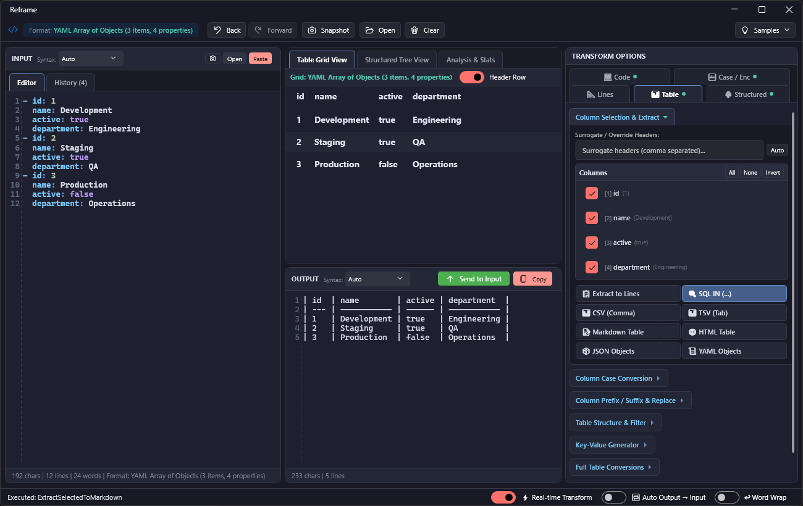

# Reframe



**Reframe** is a fast, modern desktop developer utility and text manipulation workbench built with **.NET 9** and **WPF**. It provides a comprehensive suite of real-time text transformations, tabular data conversions, interactive structured tree inspection, code generation, Roslyn C# scripting, a regex workbench, visual transformation recipes, and quick fuzzy command execution in a responsive dark-themed Fluent interface.

---

## Table of Contents

- [Features](#features)
  - [1. Command Palette & Action Fuzzy Search](#1-command-palette--action-fuzzy-search)
  - [2. Visual Recipe & Pipeline Builder](#2-visual-recipe--pipeline-builder)
  - [3. Interactive Regex Lab & Match Inspector](#3-interactive-regex-lab--match-inspector)
  - [4. Roslyn C# / LINQ Scratchpad](#4-roslyn-c--linq-scratchpad)
  - [5. Line Operations & Text Wrangling](#5-line-operations--text-wrangling)
  - [6. Tabular Data & Table Conversions](#6-tabular-data--table-conversions)
  - [7. Structured Data (JSON, YAML, XML) & Tree Viewer](#7-structured-data-json-yaml-xml--tree-viewer)
  - [8. Developer Tools, SQL & Code Generation](#8-developer-tools-sql--code-generation)
  - [9. Case Conversions](#9-case-conversions)
  - [10. Encodings, Escaping & JWT Inspector](#10-encodings-escaping--jwt-inspector)
  - [11. Real-Time Text Analysis & Format Detection](#11-real-time-text-analysis--format-detection)
  - [12. Productivity & Automation (Clipboard Watcher, History, Drag-and-Drop)](#12-productivity--automation-clipboard-watcher-history-drag-and-drop)
- [Architecture & Solution Structure](#architecture--solution-structure)
- [Prerequisites](#prerequisites)
- [Getting Started](#getting-started)
  - [Build](#build)
  - [Run](#run)
  - [Run Tests](#run-tests)
- [Tech Stack & Libraries](#tech-stack--libraries)
- [License](#license)

---

## Features

### 1. Command Palette & Action Fuzzy Search
- **Universal Quick Launcher (`Ctrl+K` / `Ctrl+P` / `Ctrl+Shift+P` / `F1`)**: Search and execute any transformation, converter, recipe, or tool with intelligent fuzzy matching.
- **Weighted Scoring**: Prefix, substring, acronym, and alias matching (e.g. typing `jwt`, `sql in`, `uuid`, `ts`, or `camel` instantly ranks top actions).
- **Full Keyboard Navigation**: Navigate results with `↑` / `↓` and press `Enter` to run.

### 2. Visual Recipe & Pipeline Builder
- **Multi-Step Transformation Chaining**: Combine sequential operations into automated pipelines (e.g., *Watch Clipboard ➔ Extract URLs ➔ Deduplicate ➔ Sort ➔ Wrap in JSON Array*).
- **Interactive Visual Editor**: Reorder steps (Up/Down), toggle individual steps on/off, and test pipelines with `F5`.
- **Custom Presets**: Save custom pipelines to the sidebar with one-click execution.
- **Import / Export**: Share recipes across teams via portable JSON recipe files.
- **Built-in Presets**: Pre-bundled with popular workflow recipes for CSV, SQL, code arrays, and data cleanup.

### 3. Interactive Regex Lab & Match Inspector
- **Live Pattern Testing**: Real-time regex evaluation as you type, with ReDoS timeout protection.
- **Capture Group Extraction Table**: Instant structured DataGrid showing match indices, lengths, and all named/numbered capture groups.
- **Match Breakdown & Exports**: View full match details or export matches/groups directly as text, TSV tables, or JSON.
- **Tested Regex Library & Cheat Sheet**: One-click presets for ISO 8601 dates, emails, SemVer 2.0, UUIDs, JWTs, IPv4/IPv6, connection strings, URLs, and hex colors.

### 4. Roslyn C# / LINQ Scratchpad
- **Sub-Millisecond Evaluation**: Run ad-hoc C# expressions and LINQ scripts directly against the input text via Microsoft.CodeAnalysis.CSharp.Scripting.
- **Rich Script Globals**: Native access to `input`, `text`, `lines`, `nonEmptyLines`, `print()`, and `dump()`.
- **Object Serialization**: Automatic dynamic JSON serialization for returned complex objects, collections, and anonymous types.
- **Built-in Script Presets**: Filter & trim, frequency grouping, CSV-to-JSON mapping, number aggregations, and regex transformations.

### 5. Line Operations & Text Wrangling
- **Quoting & Wrapping**: Wrap lines with `'single'`, `"double"`, `` `backticks` ``, `(parens)`, `[brackets]`, `{braces}`, or custom prefixes/suffixes with auto-escaping.
- **Join & Split**: Join lines with custom delimiters; split delimited strings or regex patterns into multi-line lists.
- **Sort & Deduplicate**: Alphabetical, case-insensitive, natural numeric, length, or reverse sorting; extract distinct lines, duplicates only, or count occurrences.
- **Trimming & Numbering**: Strip leading/trailing whitespace, collapse multiple spaces, remove blank lines, and apply custom line numbering (`1. `, `[1]`, `#1: `).
- **Find & Replace / Filter**: Case-sensitive, whole-word, and regex find/replace; include or exclude matching lines.

### 6. Tabular Data & Table Conversions
- **Universal Tabular Interop**: Seamless two-way conversions across **CSV**, **TSV**, **Markdown Tables**, **HTML Tables** (`<table>`), **JSON Array of Objects**, **YAML Sequences**, and **SQL INSERT Statements**.
- **Surrogate Headers & Overrides**: Auto-generate sequential column headers (`Col1, Col2...`), prepend custom headers, or override existing headers for headless data.
- **Column Operations**: Extract, transform, sort, or filter by specific columns; generate Key-Value maps with optional *rest-of-properties* value objects.
- **Interactive DataGrid Preview**: Live tabular preview grid with column sorting and surrogate header editing.

### 7. Structured Data (JSON, YAML, XML) & Tree Viewer
- **Interactive Hierarchical Tree Viewer**: Live syntax-highlighted tree inspection for JSON, YAML, and XML documents with type badges (`{ }`, `[ ]`, `< >`, `@`, `str`, `num`, `bool`, `null`) and instant search filtering.
- **Cross-Format Conversions**: Bidirectional conversion between **JSON ➔ YAML**, **JSON ➔ XML**, and **YAML ➔ XML** with attribute and type preservation.
- **XPath & JSONPath Querying**: Execute full XPath 1.0 (with namespace-tolerance and wildcard support) or JSONPath expressions; extract matched values, attributes, paths, or keys.
- **Key Casing & Filtering**: Recursively convert object keys to `camelCase`, `PascalCase`, `snake_case`, `kebab-case`, or `CONSTANT_CASE`; pick/omit keys; remove `null` and empty values.
- **Flatten & Deep Operations**: Flatten nested hierarchies to dot-notation paths or flat JSON; unflatten back to structured objects; deep recursive key sorting; minify & beautify.
- **Code & Schema Generation**: Generate typed **TypeScript Interfaces**, **C# POCO Classes**, and **JSON Schema (draft-07)**.

### 8. Developer Tools, SQL & Code Generation
- **SQL `IN (...)` Generator**: Format lists into single-line or multi-line SQL `IN ('a', 'b', 'c')` clauses with SQL string escaping and automatic SQL syntax highlighting.
- **Multi-Language Collection Generators**: Output idiomatic array/list syntax for **C#** (`string[]`, `List<T>`), **TypeScript/JavaScript** (`const arr = [...]`), **Python** (`[...]`), **JSON**, and **YAML**.
- **URL Query Strings & Key-Value Maps**: Two-way conversions between URL query parameters, JSON objects, YAML maps, and line-delimited key-value pairs.
- **Entity Extractors**: One-click extraction of emails, URLs/links, IPv4 addresses, numbers/hex values, and UUIDs/GUIDs.

### 9. Case Conversions
- Convert text per-line or across entire blocks:
  - `camelCase`
  - `PascalCase`
  - `snake_case`
  - `kebab-case`
  - `CONSTANT_CASE` (Screaming Snake)
  - `Title Case`
  - `UPPERCASE` / `lowercase`
  - `dot.case` / `path/case`

### 10. Encodings, Escaping & JWT Inspector
- **URL & HTML**: Standard percent-encoding and HTML entity encoding/decoding.
- **Base64**: Encode and decode with missing padding auto-correction.
- **JWT Inspector**: Decode and inspect JSON Web Tokens with formatted Header & Payload JSON and signature verification details.
- **C# String Escaper**: Escape or unescape special characters (`\r`, `\n`, `\t`, `\"`, `\\`) for C# string literals.
- **Multi-Format Beautifier**: Format and indent JSON, XML, HTML, and YAML.

### 11. Real-Time Text Analysis & Format Detection
- **Auto Format Detection**: Instantly detects CSV, TSV, Markdown tables, HTML tables, JSON, YAML, XML, SQL statements/queries, SQL IN clauses, Key-Value pairs, and numeric lists.
- **Live Statistics**: Displays total character count, non-whitespace characters, line count, non-empty lines, word count, distinct/duplicate counts, and tabular dimensions (delimiters, columns, rows).

### 12. Productivity & Automation
- **📋 Watch Clipboard**: Background clipboard format listener that automatically detects new clipboard text or HTML tables and populates the editor for instant transformation.
- **⚡ Real-time Transform**: Computes outputs on the fly as you type or tweak parameters.
- **🔁 Auto Output ➔ Input**: Automatically pipes transformed output back into the input pane for sequential chained workflows.
- **🕒 Input History & Timeline**: Searchable chronological history of previous inputs and operations with one-click restoration.
- **📂 File Loading & Drag-and-Drop**: Open or drag-and-drop any text, tabular, or structured file with automatic format detection and auto-formatting.
- **↩ Word Wrap & Auto Syntax Highlighting**: AvalonEdit editors with dynamic theme-aware syntax highlighting (SQL, C#, JSON, XML, YAML, etc.).

---

## Architecture & Solution Structure

```
reframe/
├── Reframe/                 # Main WPF Application (.NET 9)
│   ├── Controls/            # Custom controls (BindableTextEditor with AvalonEdit)
│   ├── Converters/          # WPF Value Converters
│   ├── Highlighting/        # AvalonEdit syntax highlighting definitions (dark theme)
│   ├── Services/            # ClipboardWatcher & system services
│   ├── Themes/              # Theme styles and control templates (SharedTheme.xaml)
│   ├── ViewModels/          # MainViewModel & RelayCommand MVVM implementation
│   ├── MainWindow.xaml      # Main user interface layout and styling
│   └── App.xaml             # Application startup and resource definitions
│
├── Reframe.Core/            # Core Transformation Engine (.NET 9)
│   ├── Actions/             # Command palette, action registry & fuzzy matcher
│   ├── Analysis/            # Format detection & real-time text analyzer
│   ├── History/             # Input and operation timeline management
│   ├── Recipes/             # Pipeline engine, recipe catalog & JSON storage
│   ├── RegexLab/            # Regex lab engine, capture groups & preset library
│   ├── Scripting/           # Roslyn C# scripting engine & preset catalog
│   ├── State/               # UI section state persistence
│   ├── Structured/          # JSON, XML, YAML parsers, tree models & transformers
│   ├── Tabular/             # CSV, TSV, Markdown, HTML table converters & parsers
│   └── Transformers/        # Line, Case, Developer, Encoding & Formatting transformers
│
└── Reframe.Tests/           # Unit Test Suite (xUnit)
    ├── ActionFuzzySearchTests.cs
    ├── CSharpScriptingTests.cs
    ├── FileLoadingTests.cs
    ├── HighlightingTests.cs
    ├── HtmlTableAndTabularTests.cs
    ├── InputHistoryTests.cs
    ├── RecipeAndPipelineTests.cs
    ├── RegexLabTests.cs
    ├── SqlSyntaxHighlightingTests.cs
    ├── TabularConversionTests.cs
    ├── WatchClipboardTests.cs
    └── XamlResourceIntegrityTests.cs
```

---

## Prerequisites

- **OS**: Windows 10 / 11 (x64 / x86 / ARM64)
- **SDK**: [.NET 9.0 SDK](https://dotnet.microsoft.com/download/dotnet/9.0) or higher
- **IDE** (Optional): JetBrains Rider 2024.3+, Visual Studio 2022 17.12+, or VS Code with C# Dev Kit

---

## Getting Started

### Build

Clone the repository and build the solution using the .NET CLI:

```powershell
dotnet build reframe.sln
```

### Run

Run the desktop application:

```powershell
dotnet run --project Reframe/Reframe.csproj
```

### Run Tests

Execute the unit test suite:

```powershell
dotnet test Reframe.Tests/Reframe.Tests.csproj
```

---

## Tech Stack & Libraries

- **Framework**: [.NET 9.0](https://dotnet.microsoft.com/) / WPF (Windows Presentation Foundation)
- **UI Library**: [WPF-UI](https://github.com/lepoco/wpfui) for modern Windows 11 Fluent design, dark theme, and controls
- **Editor Control**: [AvalonEdit](https://github.com/icsharpcode/AvalonEdit) for syntax-highlighted code and text editing
- **Scripting Engine**: [Microsoft.CodeAnalysis.CSharp.Scripting](https://www.nuget.org/packages/Microsoft.CodeAnalysis.CSharp.Scripting) for live Roslyn C# evaluation
- **Serialization**: `System.Text.Json` & [YamlDotNet](https://github.com/aaubry/YamlDotNet)
- **Testing**: [xUnit](https://xunit.net/) & `Microsoft.NET.Test.Sdk`
- **Pattern**: MVVM (Model-View-ViewModel) with XAML data binding

---

## License

This project is licensed under the terms specified in the [LICENSE](LICENSE) file.
